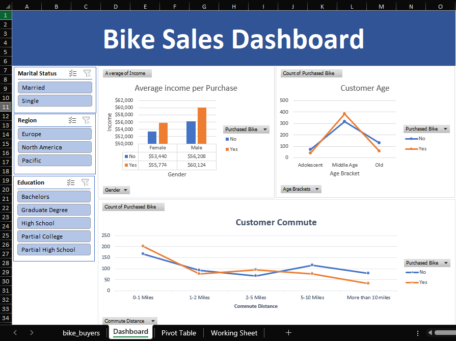

# Bike Sales Dashboard 

## Project Overview

This project demonstrates an end-to-end data analysis workflow using Microsoft Excel.
The objective was to analyze customer data and identify key factors that influence bike purchasing behavior.

The final output is an interactive dashboard that allows users to explore the data through multiple filters and visualizations.

---

## Dataset

The dataset includes customer-level information such as:

* Age and gender
* Marital status
* Education level
* Region
* Income
* Purchase decision (bike purchased or not)

---

## Process

### Data Cleaning

* Removed duplicates and inconsistencies
* Standardized categorical values
* Ensured data integrity for analysis

### Data Analysis (Pivot Tables)

* Built pivot tables to aggregate and analyze key metrics:

  * Average income by purchase decision
  * Customer distribution by age group
  * Purchase patterns across categories

### Data Visualization

* Created charts based on pivot tables:

  * Average income per purchase (segmented by gender)
  * Customer age distribution
  * Commute distance vs purchase behavior

### Dashboard Development

* Combined all visualizations into a single dashboard
* Structured layout for clarity and usability

### Interactivity

* Added slicers to filter data by:

  * Marital status
  * Region
  * Education level
* Enabled dynamic updates across all visuals

---

## Dashboard Preview

---

## Key Insights

* Higher income is positively correlated with bike purchases
* Middle-aged customers represent the largest group of buyers
* Customers with shorter commute distances are more likely to purchase bikes
* Demographic factors such as education and region influence purchasing behavior

---

## Tools

* Microsoft Excel

  * Pivot Tables
  * Charts
  * Slicers

---

## Outcome

This project highlights:

* Ability to clean and prepare data for analysis
* Proficiency in Excel for analytical tasks
* Experience in building interactive dashboards
* Capability to extract and communicate insights from data
